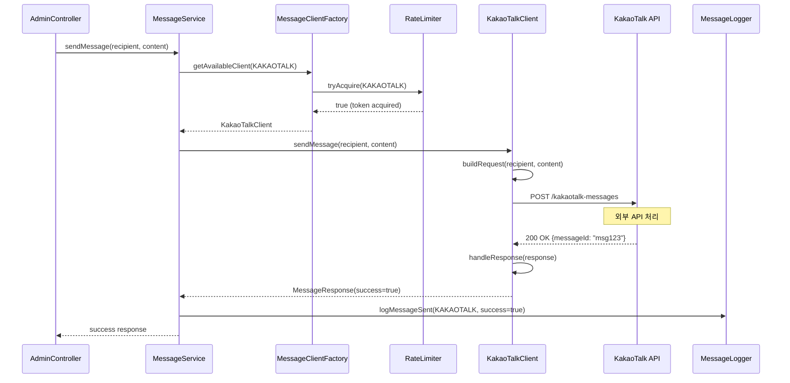
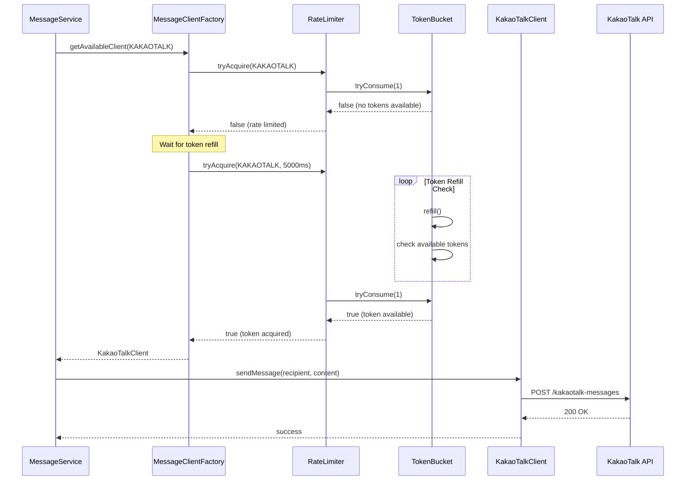
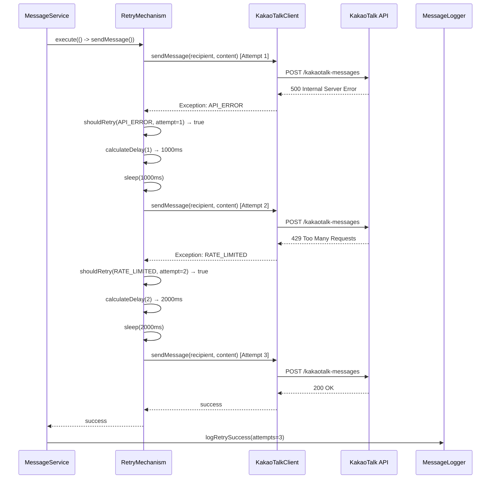
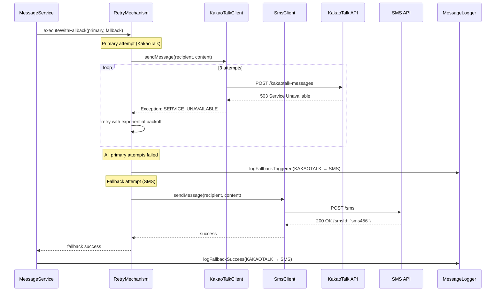
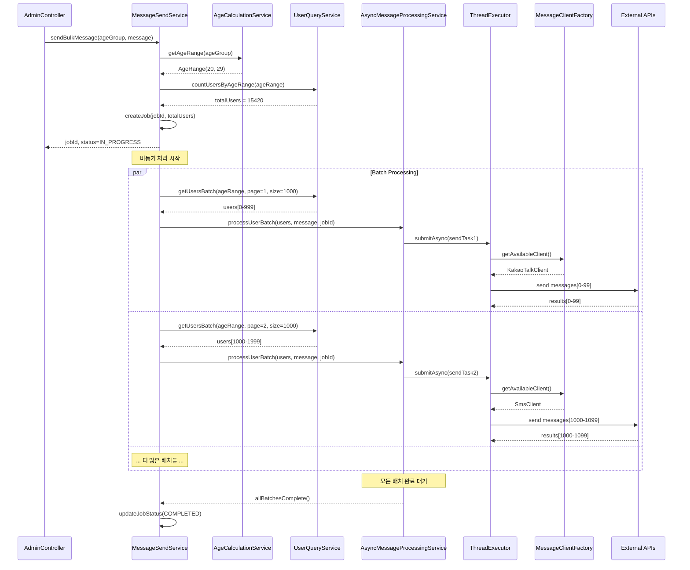
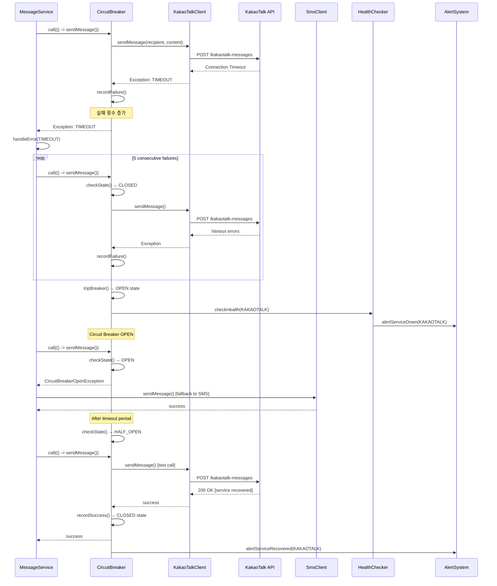
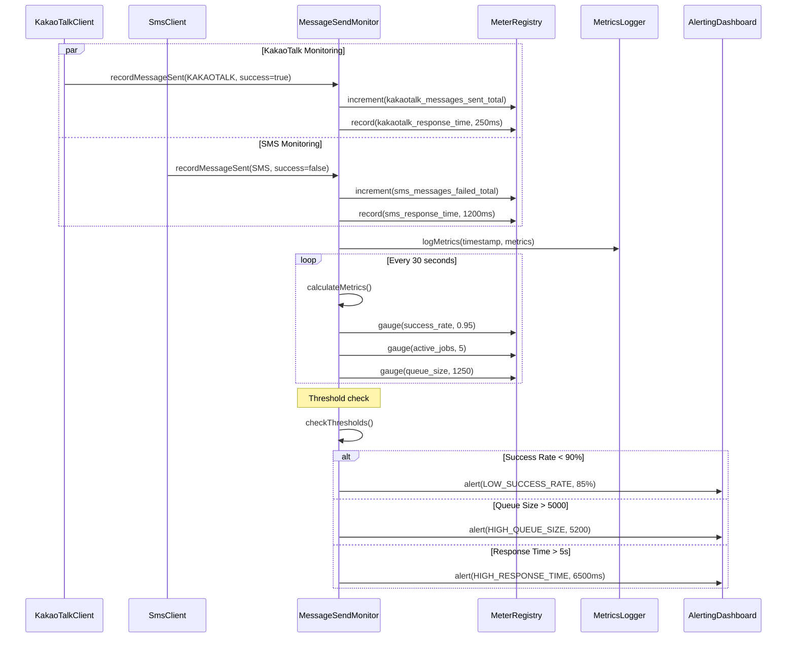
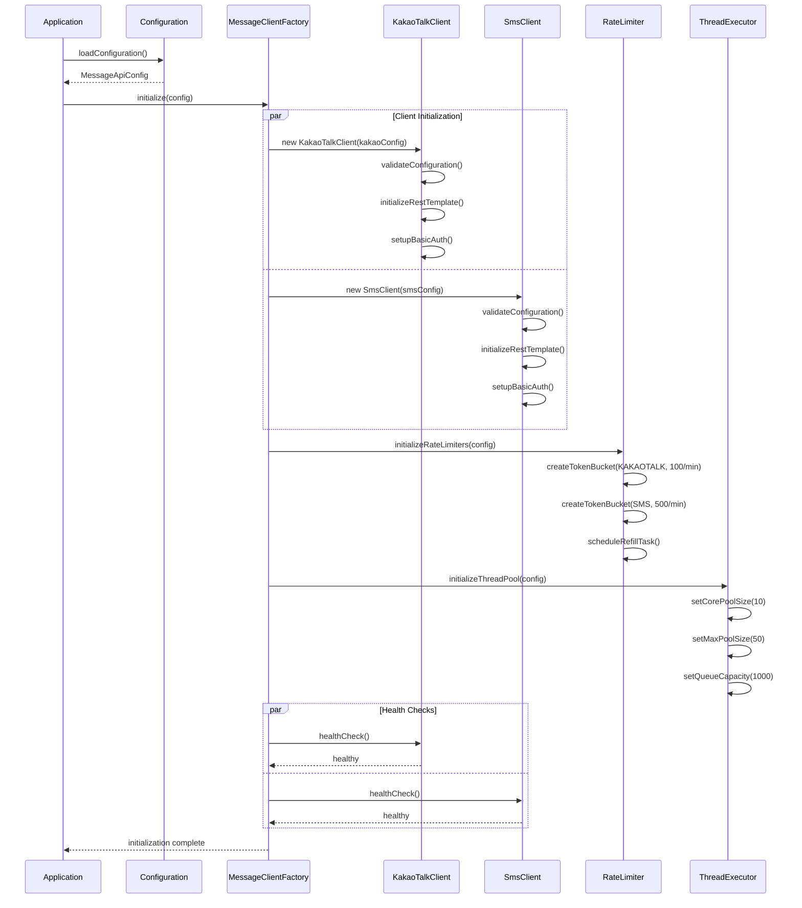

# 외부 API 연동 시퀀스 다이어그램

## 1. 단일 메시지 발송 시퀀스 (정상 케이스)

## 2. Rate Limiting으로 인한 대기 시퀀스

## 3. 재시도 메커니즘 시퀀스

## 4. 대체 발송 (Fallback) 시퀀스

## 5. 대용량 메시지 발송 시퀀스

## 6. 에러 처리 및 복구 시퀀스

## 7. 메시지 발송 모니터링 시퀀스

## 8. 설정 및 초기화 시퀀스

이러한 시퀀스 다이어그램들은 Task 9와 Task 10의 구현 시 참고할 수 있는 상세한 상호작용 플로우를 제공하며, 각종 예외 상황과 복구 메커니즘까지 포함하고 있습니다.