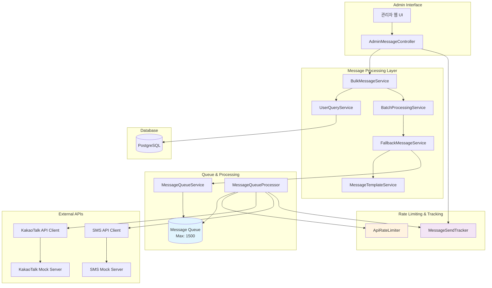
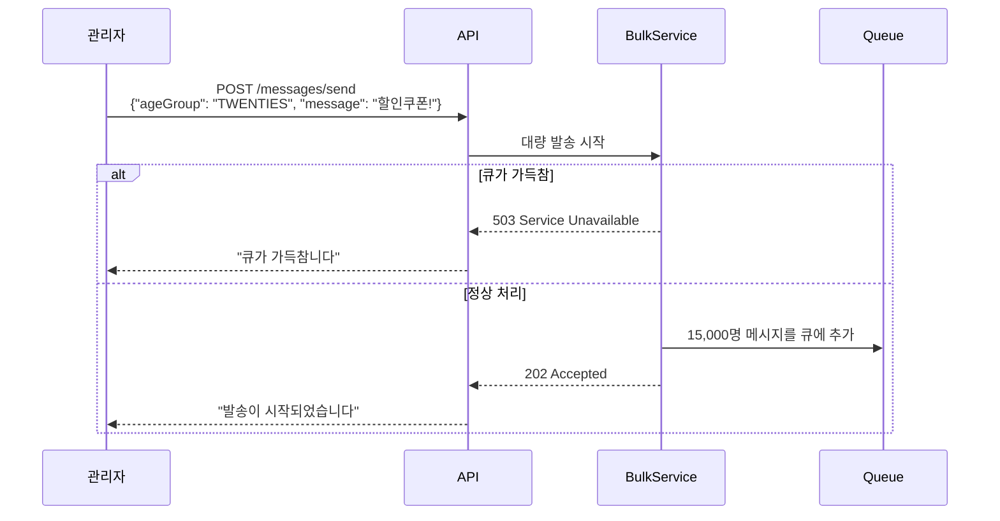
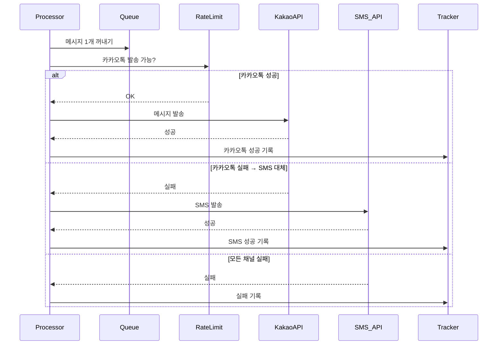
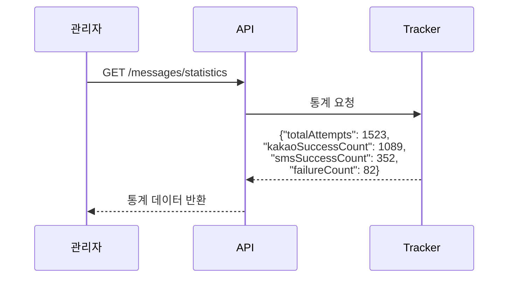

# 현재 메시지 전송 시스템 아키텍처

## 전체 아키텍처

## 메시지 전송 시퀀스 다이어그램

### 1. 대량 메시지 발송 요청

### 2. 백그라운드 메시지 처리 (10ms마다 실행)

### 3. 통계 조회

## 주요 구성 요소 설명

### 1. **메시지 큐 시스템**
- **용량**: 최대 1500개 메시지
- **처리 주기**: 10ms마다 백그라운드 처리
- **큐 가득참 시**: 즉시 실패 응답 (503 Service Unavailable)

### 2. **Rate Limiting**
- **KakaoTalk**: 분당 100건 제한
- **SMS**: 분당 500건 제한
- **슬라이딩 윈도우** 방식으로 정확한 속도 제어

### 3. **Fallback 메커니즘**
- **1순위**: KakaoTalk 발송 시도
- **2순위**: 실패 시 SMS로 자동 전환
- **최종 실패**: 모든 채널 실패 시 FAILED_BOTH 기록

### 4. **통계 수집**
- **실시간 추적**: 모든 발송 결과 실시간 카운팅
- **채널별 분리**: 카카오톡/SMS 성공 건수 별도 집계
- **정확성 보장**: totalAttempts = kakaoSuccessCount + smsSuccessCount + failureCount

### 5. **템플릿 시스템**
- **자동 추가**: "#{회원명}님, 안녕하세요. 현대 오토에버입니다. #{원본메시지}"
- **개인화**: 각 회원별 이름 자동 치환

### 6. **배치 처리**
- **배치 크기**: 100명씩 처리
- **비동기 실행**: 대량 발송 시 즉시 응답 후 백그라운드 처리
- **진행상황 추적**: 실시간 성공/실패 카운팅

### 7. **에러 처리**
- **큐 포화**: 즉시 실패 응답으로 사용자 경험 개선  
- **Rate Limit**: 자동 대기 후 재시도
- **API 장애**: 채널 간 Fallback으로 가용성 확보