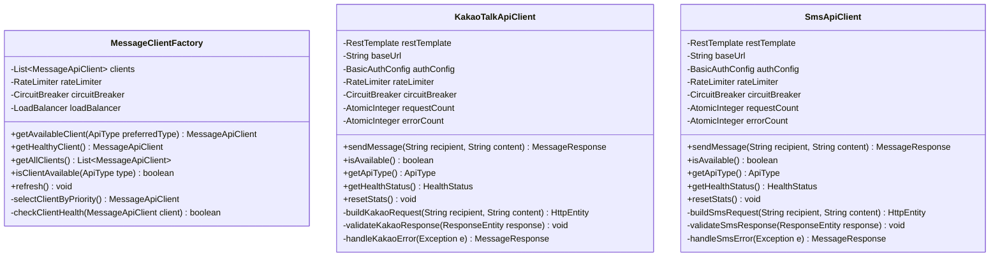
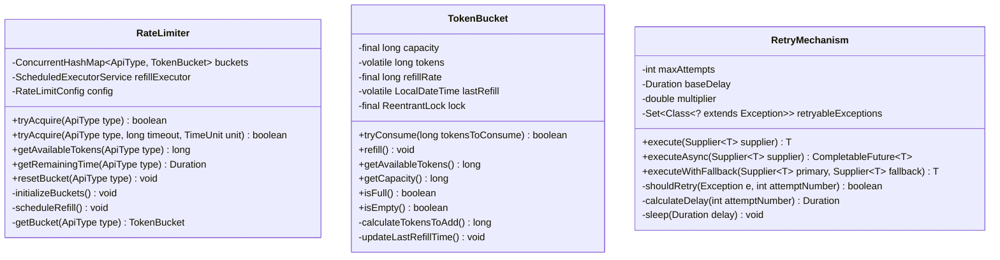
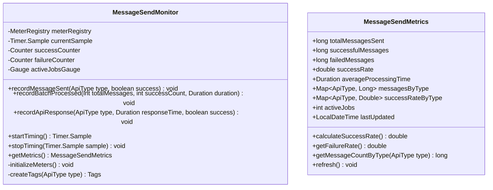

# 메시지 시스템 클래스 다이어그램

## 전체 클래스 구조 개요

```mermaid
classDiagram
    %% 컨트롤러 레이어
    class AdminController {
        -MessageSendService messageSendService
        +sendBulkMessage(MessageSendDto) ResponseEntity
        +getMessageSendStatus(UUID) ResponseEntity
        +cancelMessageSend(UUID) ResponseEntity
    }
    
    %% 서비스 레이어
    class MessageSendService {
        -AgeCalculationService ageCalculationService
        -UserQueryService userQueryService
        -AsyncMessageProcessingService asyncService
        -MessageStatusTracker statusTracker
        +sendBulkMessage(MessageSendDto) BulkMessageResponse
        +getMessageSendStatus(UUID) MessageSendStatus
        +cancelMessageSend(UUID) boolean
    }
    
    class AgeCalculationService {
        +calculateAge(String socialNumber) int
        +getAgeRange(AgeGroup) AgeRange
        +isInAgeGroup(String socialNumber, AgeGroup) boolean
    }
    
    class UserQueryService {
        -UserRepository userRepository
        +getUsersByAgeRange(AgeRange, Pageable) Page~User~
        +countUsersByAgeRange(AgeRange) long
        +getUsersByAgeRangeBatch(AgeRange, int batchSize) Stream~List~User~~
    }
    
    class AsyncMessageProcessingService {
        -ThreadPoolTaskExecutor executor
        -MessageClientFactory messageClientFactory
        -MessageStatusTracker statusTracker
        +processUserBatch(List~User~, String, UUID) CompletableFuture~BatchResult~
        +sendMessageAsync(User, String) CompletableFuture~MessageResult~
    }
    
    %% DTO 클래스들
    class MessageSendDto {
        +String ageGroup
        +String message
        +validate() boolean
        +getAgeGroupEnum() AgeGroup
    }
    
    class BulkMessageResponse {
        +UUID jobId
        +int totalUsers
        +String estimatedDuration
        +JobStatus status
        +LocalDateTime startedAt
    }
    
    class MessageSendStatus {
        +UUID jobId
        +JobStatus status
        +int totalUsers
        +int successCount
        +int failureCount
        +LocalDateTime startedAt
        +LocalDateTime completedAt
        +Duration duration
        +List~String~ errors
    }
    
    class BatchResult {
        +int totalMessages
        +int successCount
        +int failureCount
        +List~MessageResult~ results
        +Duration processingTime
    }
    
    class MessageResult {
        +String recipient
        +ApiType apiType
        +MessageStatus status
        +String errorMessage
        +LocalDateTime sentAt
    }
    
    %% 열거형 클래스들
    class AgeGroup {
        <<enumeration>>
        TEENS
        TWENTIES  
        THIRTIES
        FORTIES
        FIFTIES_PLUS
        +getDisplayName() String
        +getAgeRange() AgeRange
    }
    
    class JobStatus {
        <<enumeration>>
        CREATED
        IN_PROGRESS
        PROCESSING_BATCH
        SENDING_MESSAGES
        COMPLETED
        PARTIALLY_FAILED
        FAILED
        CANCELLED
    }
    
    class MessageStatus {
        <<enumeration>>
        PENDING
        SENT
        FAILED
        RETRY_PENDING
    }
    
    class ApiType {
        <<enumeration>>
        KAKAOTALK
        SMS
        +getDisplayName() String
        +getRateLimit() int
    }
    
    %% 값 객체들
    class AgeRange {
        +int minAge
        +int maxAge
        +contains(int age) boolean
        +toString() String
    }
    
    %% 메시지 클라이언트 레이어
    class MessageClientFactory {
        -List~MessageApiClient~ clients
        -RateLimiter rateLimiter
        +getAvailableClient(ApiType) MessageApiClient
        +getAllClients() List~MessageApiClient~
        +isClientAvailable(ApiType) boolean
    }
    
    class MessageApiClient {
        <<interface>>
        +sendMessage(String recipient, String content) MessageResponse
        +isAvailable() boolean
        +getApiType() ApiType
        +getHealthStatus() HealthStatus
    }
    
    class KakaoTalkApiClient {
        -RestTemplate restTemplate
        -String baseUrl
        -BasicAuthConfig authConfig
        -RateLimiter rateLimiter
        +sendMessage(String, String) MessageResponse
        +isAvailable() boolean
        +getApiType() ApiType
        +getHealthStatus() HealthStatus
        -buildRequest(String, String) HttpEntity
        -handleResponse(ResponseEntity) MessageResponse
    }
    
    class SmsApiClient {
        -RestTemplate restTemplate
        -String baseUrl
        -BasicAuthConfig authConfig
        -RateLimiter rateLimiter
        +sendMessage(String, String) MessageResponse
        +isAvailable() boolean  
        +getApiType() ApiType
        +getHealthStatus() HealthStatus
        -buildRequest(String, String) HttpEntity
        -handleResponse(ResponseEntity) MessageResponse
    }
    
    class MessageResponse {
        +boolean success
        +String messageId
        +String errorCode
        +String errorMessage
        +LocalDateTime timestamp
        +ApiType apiType
    }
    
    %% 설정 클래스들
    class BasicAuthConfig {
        +String username
        +String password
        +getAuthHeader() String
    }
    
    class HealthStatus {
        +boolean healthy
        +String status
        +LocalDateTime lastCheck
        +String errorMessage
    }
    
    %% Rate Limiting 시스템
    class RateLimiter {
        -Map~ApiType, TokenBucket~ buckets
        +tryAcquire(ApiType) boolean
        +tryAcquire(ApiType, long timeout) boolean
        +getAvailableTokens(ApiType) long
        +getRemainingTime(ApiType) Duration
    }
    
    class TokenBucket {
        -long capacity
        -long tokens
        -long refillRate
        -LocalDateTime lastRefill
        +tryConsume(long) boolean
        +refill() void
        +getAvailableTokens() long
    }
    
    %% 재시도 메커니즘
    class RetryMechanism {
        -int maxAttempts
        -Duration baseDelay
        -double multiplier
        +execute(Supplier) Object
        +executeAsync(Supplier) CompletableFuture
        -calculateDelay(int attempt) Duration
        -shouldRetry(Exception) boolean
    }
    
    %% 상태 추적 시스템
    class MessageStatusTracker {
        -Map~UUID, BulkMessageJob~ activeJobs
        -MessageSendRepository repository
        +createJob(MessageSendDto) BulkMessageJob
        +updateJobStatus(UUID, JobStatus) void
        +incrementSuccessCount(UUID) void
        +incrementFailureCount(UUID) void
        +getJobStatus(UUID) MessageSendStatus
        +completeJob(UUID) void
    }
    
    class BulkMessageJob {
        +UUID jobId
        +String ageGroup
        +String message
        +JobStatus status
        +int totalUsers
        +AtomicInteger successCount
        +AtomicInteger failureCount
        +LocalDateTime createdAt
        +LocalDateTime startedAt
        +LocalDateTime completedAt
        +List~String~ errors
        +synchronized void addError(String)
        +Duration getDuration()
    }
    
    %% 모니터링 및 로깅
    class MessageSendMonitor {
        -MeterRegistry meterRegistry
        -MessageSendMetrics metrics
        +recordMessageSent(ApiType, boolean)
        +recordBatchProcessed(int, int, Duration)
        +recordApiResponse(ApiType, Duration, boolean)
        +getMetrics() MessageSendMetrics
    }
    
    class MessageSendMetrics {
        +long totalMessagesSent
        +long successfulMessages
        +long failedMessages
        +double successRate
        +Duration averageProcessingTime
        +Map~ApiType, Long~ messagesByType
    }
    
    %% 레포지토리 레이어
    class MessageSendRepository {
        <<interface>>
        +save(BulkMessageJob) BulkMessageJob
        +findById(UUID) Optional~BulkMessageJob~
        +findByStatus(JobStatus) List~BulkMessageJob~
        +findRecentJobs(int limit) List~BulkMessageJob~
    }
    
    %% 관계 정의
    AdminController --> MessageSendService
    MessageSendService --> AgeCalculationService
    MessageSendService --> UserQueryService  
    MessageSendService --> AsyncMessageProcessingService
    MessageSendService --> MessageStatusTracker
    
    AsyncMessageProcessingService --> MessageClientFactory
    AsyncMessageProcessingService --> MessageStatusTracker
    
    MessageClientFactory --> MessageApiClient
    MessageApiClient <|.. KakaoTalkApiClient
    MessageApiClient <|.. SmsApiClient
    
    KakaoTalkApiClient --> BasicAuthConfig
    KakaoTalkApiClient --> RateLimiter
    SmsApiClient --> BasicAuthConfig
    SmsApiClient --> RateLimiter
    
    RateLimiter --> TokenBucket
    
    MessageStatusTracker --> BulkMessageJob
    MessageStatusTracker --> MessageSendRepository
    
    AsyncMessageProcessingService --> RetryMechanism
    AsyncMessageProcessingService --> MessageSendMonitor
    
    MessageSendService ..> MessageSendDto
    MessageSendService ..> BulkMessageResponse
    MessageSendService ..> MessageSendStatus
    
    AsyncMessageProcessingService ..> BatchResult
    MessageApiClient ..> MessageResponse
    
    AgeCalculationService ..> AgeGroup
    AgeCalculationService ..> AgeRange
    
    BulkMessageJob ..> JobStatus
    MessageResult ..> MessageStatus
    MessageResult ..> ApiType
```

## 핵심 컴포넌트별 상세 클래스

### 1. 메시지 발송 코어 클래스들

```mermaid
classDiagram
    class MessageSendService {
        -AgeCalculationService ageCalculationService
        -UserQueryService userQueryService
        -AsyncMessageProcessingService asyncService
        -MessageStatusTracker statusTracker
        -Logger logger
        
        +sendBulkMessage(MessageSendDto dto) BulkMessageResponse
        +getMessageSendStatus(UUID jobId) MessageSendStatus
        +cancelMessageSend(UUID jobId) boolean
        
        -validateRequest(MessageSendDto dto) void
        -calculateTotalUsers(AgeGroup ageGroup) long
        -createJob(MessageSendDto dto, long totalUsers) BulkMessageJob
        -processUsersInBatches(BulkMessageJob job) CompletableFuture~Void~
    }
    
    class AsyncMessageProcessingService {
        -ThreadPoolTaskExecutor executor
        -MessageClientFactory messageClientFactory
        -MessageStatusTracker statusTracker
        -RetryMechanism retryMechanism
        -MessageSendMonitor monitor
        
        +processUserBatch(List~User~ users, String message, UUID jobId) CompletableFuture~BatchResult~
        +sendMessageAsync(User user, String message) CompletableFuture~MessageResult~
        
        -selectBestClient() MessageApiClient
        -handleSendResult(MessageResult result, UUID jobId) void
        -logBatchResult(BatchResult result) void
    }
    
    class MessageStatusTracker {
        -ConcurrentHashMap~UUID, BulkMessageJob~ activeJobs
        -MessageSendRepository repository
        -ReentrantReadWriteLock lock
        
        +createJob(MessageSendDto dto) BulkMessageJob
        +updateJobStatus(UUID jobId, JobStatus status) void
        +incrementSuccessCount(UUID jobId) void
        +incrementFailureCount(UUID jobId) void
        +addError(UUID jobId, String error) void
        +getJobStatus(UUID jobId) MessageSendStatus
        +completeJob(UUID jobId) void
        +cleanup() void
        
        -persistJob(BulkMessageJob job) void
        -buildStatus(BulkMessageJob job) MessageSendStatus
    }
```

### 2. 메시지 클라이언트 시스템

### 3. Rate Limiting 및 재시도 시스템

### 4. 모니터링 및 메트릭스

## 클래스 간 주요 상호작용

### 1. 메시지 발송 플로우
1. **AdminController** → **MessageSendService**: 발송 요청 접수
2. **MessageSendService** → **AgeCalculationService**: 연령대 계산
3. **MessageSendService** → **UserQueryService**: 대상 사용자 조회
4. **MessageSendService** → **AsyncMessageProcessingService**: 비동기 처리 위임
5. **AsyncMessageProcessingService** → **MessageClientFactory**: 클라이언트 선택
6. **MessageClientFactory** → **KakaoTalkApiClient/SmsApiClient**: 실제 발송

### 2. Rate Limiting 플로우
1. **MessageApiClient** → **RateLimiter**: 토큰 요청
2. **RateLimiter** → **TokenBucket**: 토큰 소비 시도
3. **TokenBucket**: 토큰 부족 시 대기 또는 거부

### 3. 재시도 메커니즘
1. **AsyncMessageProcessingService** → **RetryMechanism**: 재시도 실행
2. **RetryMechanism** → **MessageApiClient**: 원본 호출
3. 실패 시: **RetryMechanism** → **MessageApiClient**: 재시도 호출
4. 최종 실패 시: **RetryMechanism** → **MessageApiClient**: 대체 클라이언트 호출

이 클래스 다이어그램은 Task 9와 Task 10의 요구사항을 모두 만족하는 확장 가능하고 유지보수 가능한 메시지 시스템 아키텍처를 제공합니다.