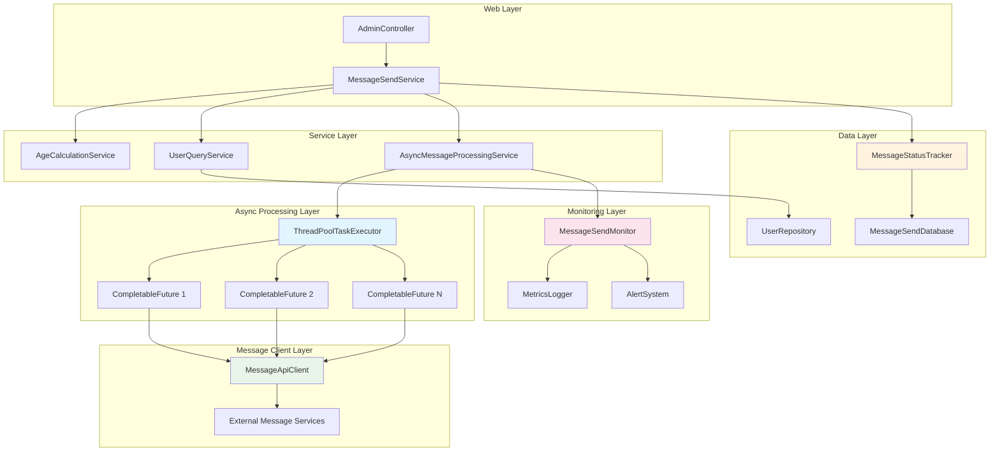
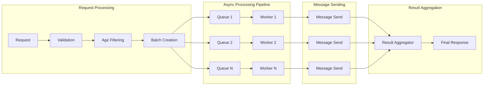
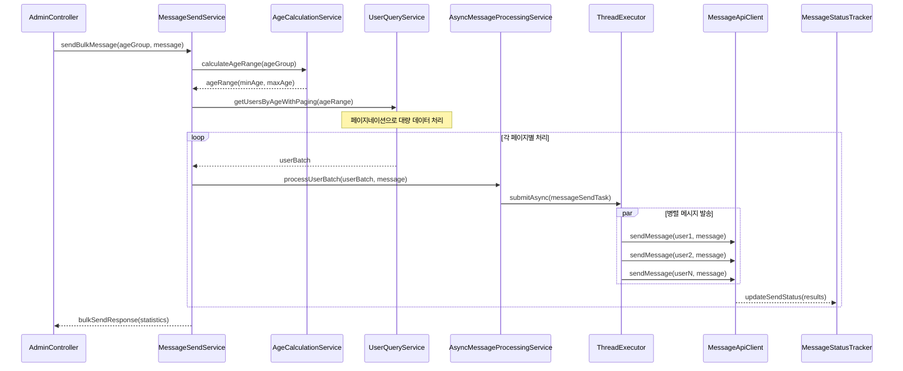
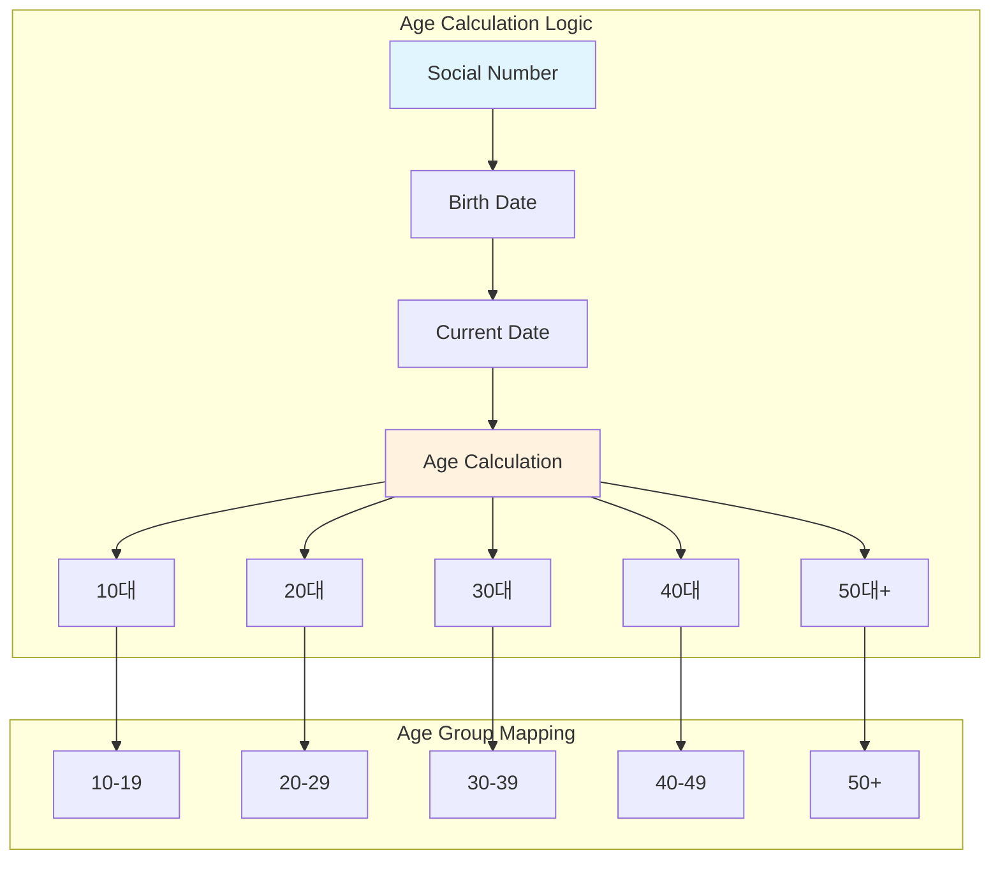
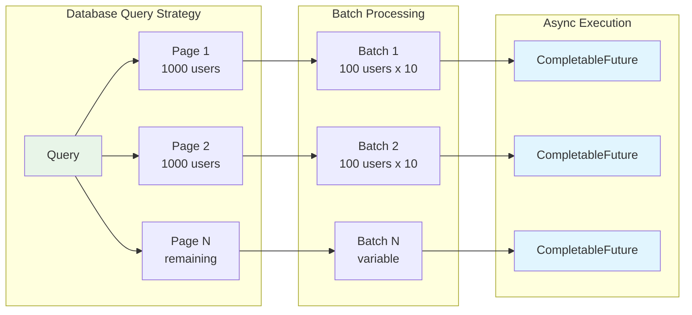
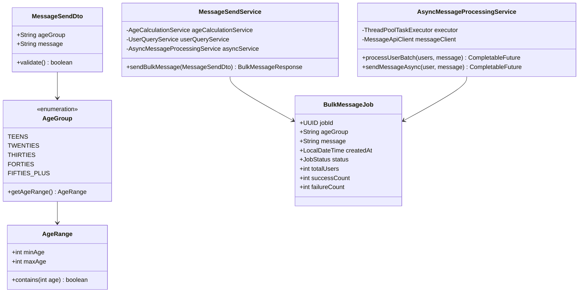
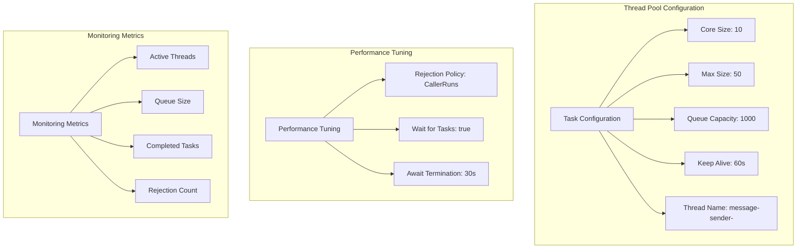
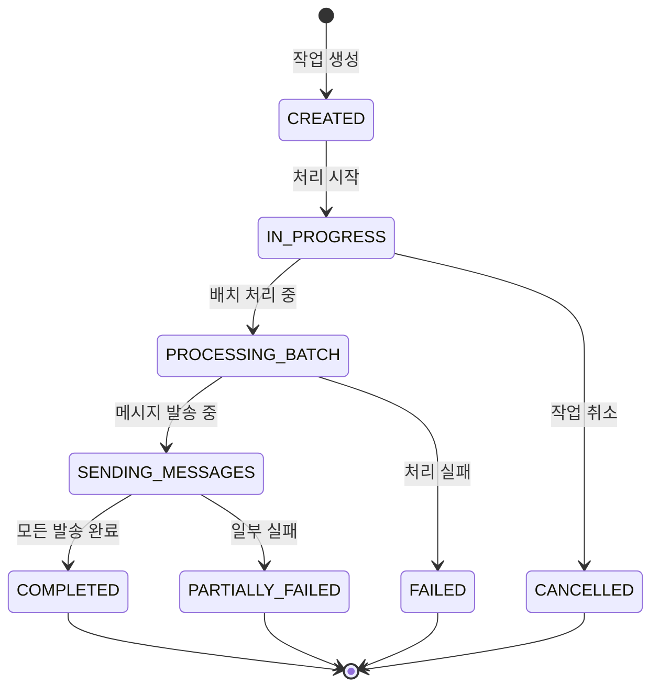

# Task 10: 대용량 메시지 발송 시스템 아키텍처

## 시스템 개요
연령대별 전체 회원 대상 메시지 발송 기능을 비동기 처리와 함께 구현하는 고성능 시스템

## 전체 시스템 아키텍처



## 비동기 처리 아키텍처



## 데이터 처리 플로우



## 연령 계산 시스템



## 페이지네이션 및 배치 처리



## 클래스 구조 설계



## ThreadPoolTaskExecutor 설정



## 메시지 발송 상태 추적



## API 설계

### Bulk Message Send Endpoint
```
POST /api/admin/messages/send
Content-Type: application/json
Authorization: Bearer {jwt_token}

Request Body:
{
  "ageGroup": "TWENTIES",
  "message": "할인 쿠폰이 발급되었습니다!"
}

Response:
{
  "success": true,
  "message": "대량 메시지 발송이 시작되었습니다.",
  "data": {
    "jobId": "550e8400-e29b-41d4-a716-446655440000",
    "totalUsers": 15420,
    "estimatedDuration": "PT15M",
    "status": "IN_PROGRESS"
  }
}
```

### Job Status Check Endpoint
```
GET /api/admin/messages/send/{jobId}/status
Authorization: Bearer {jwt_token}

Response:
{
  "success": true,
  "message": "작업 상태 조회 성공",
  "data": {
    "jobId": "550e8400-e29b-41d4-a716-446655440000",
    "status": "COMPLETED",
    "totalUsers": 15420,
    "successCount": 15380,
    "failureCount": 40,
    "startedAt": "2024-01-15T10:00:00",
    "completedAt": "2024-01-15T10:12:30",
    "duration": "PT12M30S"
  }
}
```

## 성능 최적화 전략

### 1. 데이터베이스 최적화
```sql
-- 연령별 사용자 조회 최적화 인덱스
CREATE INDEX idx_user_birth_date ON users(social_number);
CREATE INDEX idx_user_status ON users(status) WHERE status = 'ACTIVE';
```

### 2. JVM 튜닝 파라미터
```bash
-Xms2g -Xmx4g
-XX:+UseG1GC
-XX:MaxGCPauseMillis=200
-XX:+UseStringDeduplication
```

### 3. 모니터링 메트릭
- **처리량**: messages/second
- **응답시간**: average, 95th percentile
- **실패율**: failure rate %
- **메모리 사용량**: heap utilization
- **스레드 풀 상태**: active/idle threads

## 에러 처리 및 복구 전략

1. **Database Connection Pool Exhaustion**
   - Connection pool 크기 증가
   - 쿼리 타임아웃 설정

2. **Memory OutOfMemory**
   - 배치 크기 감소
   - GC 튜닝

3. **External API Rate Limiting**
   - 백오프 전략 적용
   - 큐 기반 재시도

4. **Thread Pool Saturation**
   - 동적 스케일링
   - 우선순위 큐 도입

## 보안 고려사항

1. **개인정보 보호**
   - 주민등록번호 마스킹
   - 메시지 내용 로깅 제한

2. **API 접근 제어**
   - 관리자 권한 필수
   - IP 화이트리스트

3. **감사 로깅**
   - 대량 발송 이력 기록
   - 접근 로그 보존