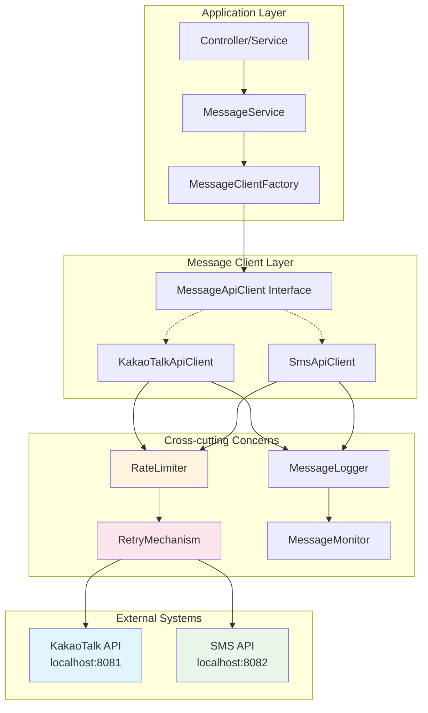
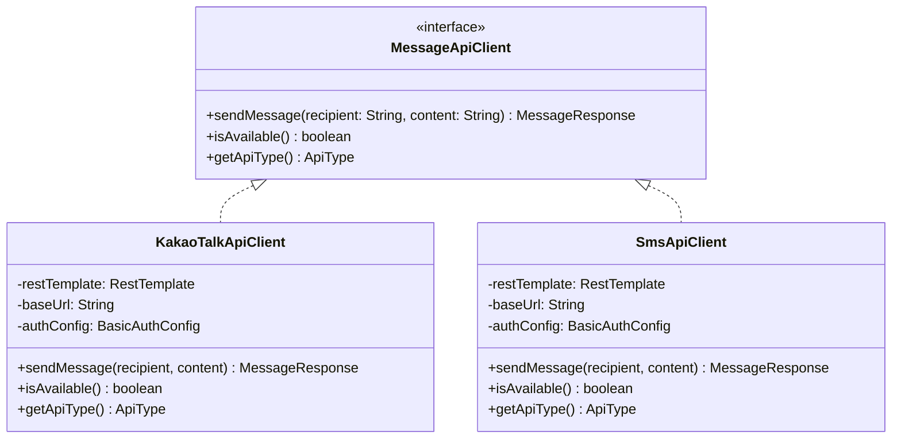
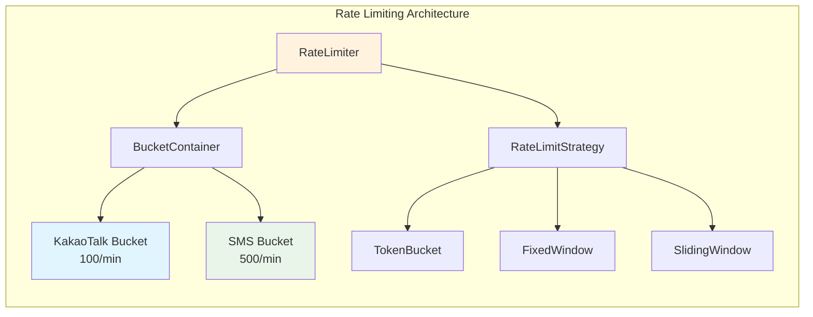
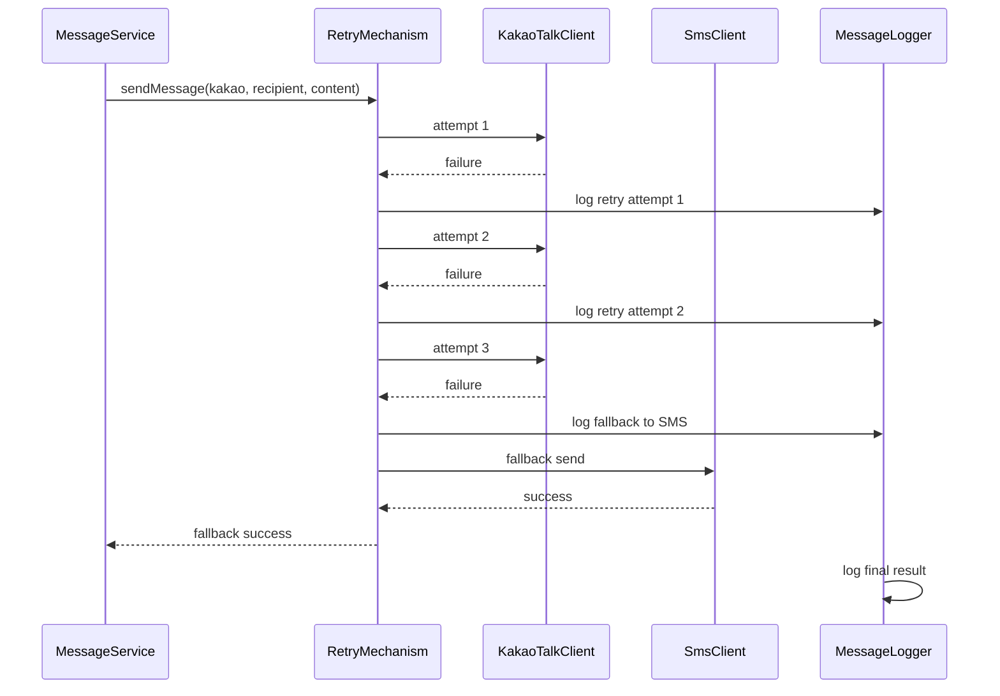
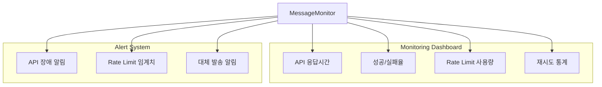

# Task 9: 외부 메시지 API 클라이언트 시스템 아키텍처

## 시스템 개요
카카오톡과 SMS 외부 API 연동을 위한 클라이언트와 속도 제한 관리 시스템

## 전체 시스템 아키텍처



## 컴포넌트 상세 설계

### 1. MessageApiClient 인터페이스


### 2. Rate Limiting 시스템


### 3. 재시도 및 대체 발송 메커니즘


## API 엔드포인트 설계

### 외부 API 연동 사양

#### 1. KakaoTalk API
- **URL**: `POST localhost:8081/kakaotalk-messages`
- **Authentication**: Basic Auth (autoever:1234)
- **Rate Limit**: 100회/분
- **Request Format**:
```json
{
  "recipient": "010-1234-5678",
  "message": "메시지 내용"
}
```

#### 2. SMS API
- **URL**: `POST localhost:8082/sms`
- **Authentication**: Basic Auth (autoever:5678)
- **Rate Limit**: 500회/분
- **Request Format**:
```json
{
  "phoneNumber": "010-1234-5678",
  "content": "메시지 내용"
}
```

## 기술 스택 및 라이브러리

### 1. HTTP 클라이언트
- **RestTemplate** or **WebClient**
- Spring Boot의 기본 HTTP 클라이언트 활용

### 2. Rate Limiting
- **Bucket4j** 라이브러리 (권장)
- 또는 커스텀 Token Bucket 구현

### 3. 재시도 메커니즘
- **@Retryable** 어노테이션 (Spring Retry)
- **ExponentialBackoff** 전략 적용

### 4. 모니터링 & 로깅
- **Micrometer** + **Prometheus** (메트릭)
- **SLF4J** + **Logback** (로깅)

## 설정 관리

### application.yml
```yaml
message:
  api:
    kakaotalk:
      base-url: http://localhost:8081
      auth:
        username: autoever
        password: 1234
      rate-limit:
        requests-per-minute: 100
    sms:
      base-url: http://localhost:8082
      auth:
        username: autoever
        password: 5678
      rate-limit:
        requests-per-minute: 500
  retry:
    max-attempts: 3
    backoff-delay: 1000
    multiplier: 2.0
```

## 모니터링 및 알림 체계



## 에러 처리 전략

1. **Connection Timeout**: 5초 후 재시도
2. **Rate Limit Exceeded**: 지수 백오프로 재시도
3. **Authentication Failed**: 즉시 알림, 수동 개입 필요
4. **Service Unavailable**: 대체 서비스로 자동 전환
5. **Invalid Request**: 로깅 후 실패 처리

## 성능 최적화 방안

1. **Connection Pool**: HTTP 연결 재사용
2. **Async Processing**: 비동기 메시지 발송
3. **Bulk Operations**: 가능한 경우 배치 처리
4. **Circuit Breaker**: 장애 전파 방지
5. **Local Cache**: 설정 정보 캐싱